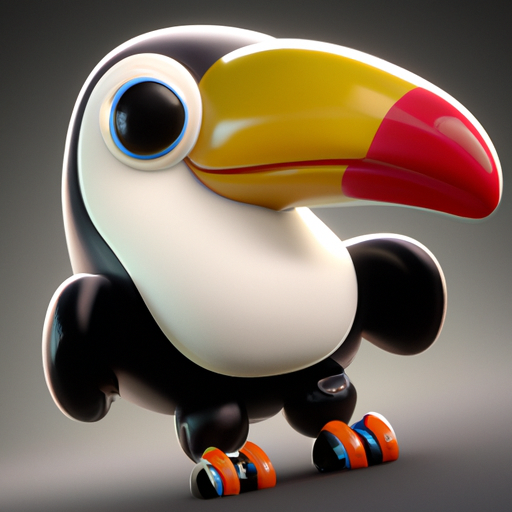

# Generate-Images-with-DALL-E-2-and-OpenAI-API

## Project's Objective

OpenAI describes DALL·E 2 as "an AI system that can create realistic images and art from a description in natural language."  It is an oustanding tool, which allows creating images on the fly.

Objective of this project is to test DALL·E 2 in generating images, based on text prompts and also to create variations of the generated image.

## Image Generated:
With the prompt "Pixar style 3D render of a baby tucan, high resolution", the following image was generated:

Creating variations of the generated image above:

## References:

1. OpenAI Documentation on Image Generation is available at [this link](https://platform.openai.com/docs/guides/images).

2. Tutorial "Generate Images With DALL·E 2 and the OpenAI API" by Martin Breuss is available at [the following link](https://realpython.com/generate-images-with-dalle-openai-api/).
